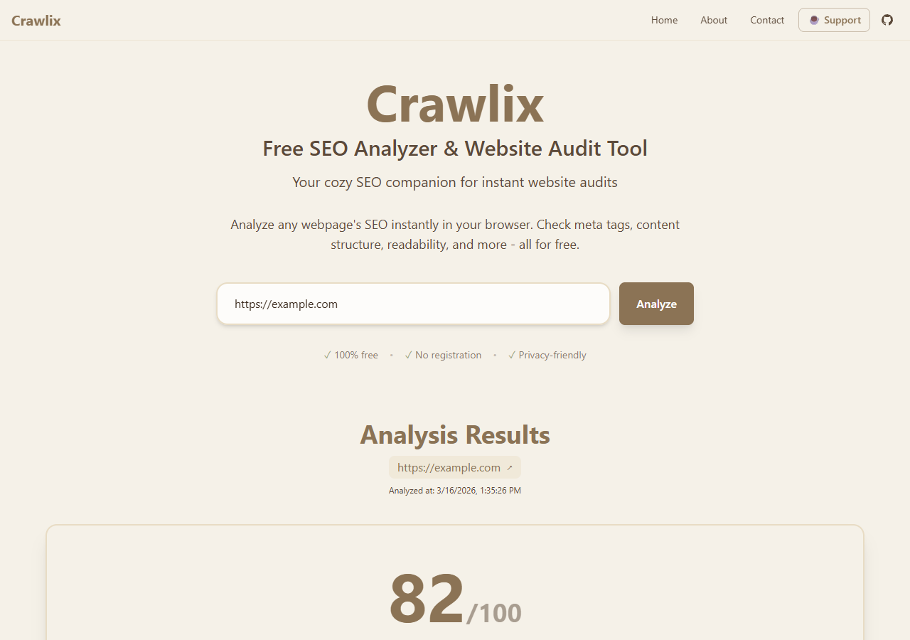
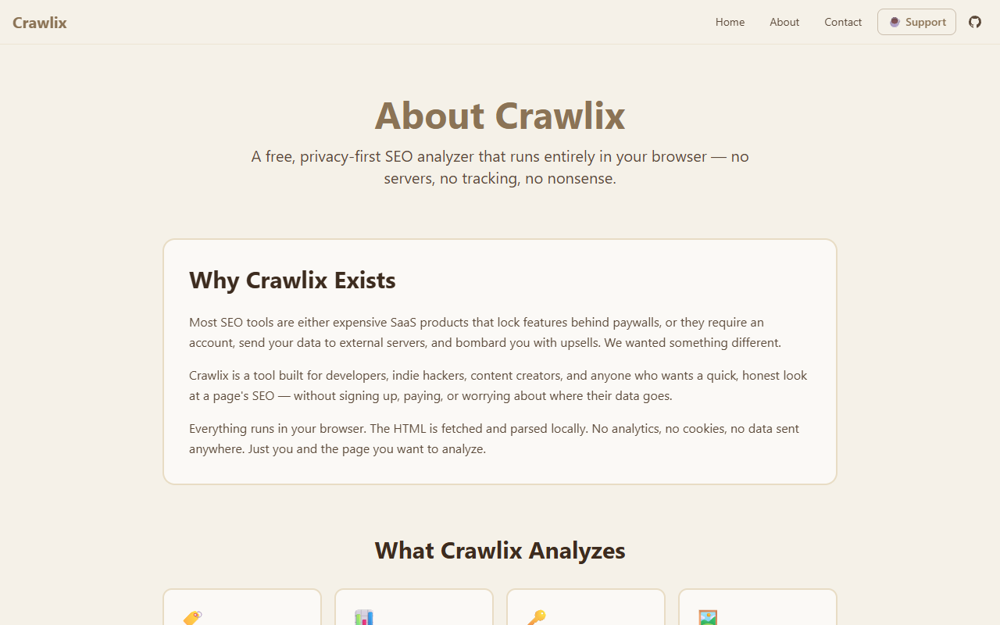

# Crawlix

**Free SEO Analyzer & Website Audit Tool — runs entirely in your browser.**

No sign-up. No paywalls. No data sent anywhere. Paste a URL and get a comprehensive SEO audit in seconds.

🌐 **Live:** [crawlix.krinc.in](https://crawlix.krinc.in) &nbsp;|&nbsp; ⭐ **Star on GitHub** if it helped you!

---



---

## What It Analyzes

Crawlix runs 8 SEO checks directly in your browser:

| Check | What it covers |
|---|---|
| **Meta Tags** | Title, description, Open Graph, Twitter cards, canonical, charset, language |
| **Readability** | Flesch Reading Ease score and grade level |
| **Keywords** | 1, 2, and 3-word phrase density and frequency |
| **Images** | Alt text coverage, dimensions, lazy loading attributes |
| **Links** | Internal vs external links, anchor text quality |
| **Headings** | H1–H6 hierarchy, count, and structure |
| **Schema** | JSON-LD structured data detection and validation |
| **Issues** | Consolidated SEO problems with actionable suggestions |

Export results as **JSON**, **CSV**, **Markdown**, or **plain text**.

---

## About Page



---

## Why Crawlix?

Most SEO tools are expensive SaaS products that require accounts and send your data to third-party servers.

- **100% browser-side** — HTML is fetched and parsed locally, nothing leaves your machine
- **No accounts** — open and use instantly
- **No analytics or tracking** — zero cookies, zero data collection
- **Open source** — audit every line, contribute improvements

---

## Tech Stack

- **Next.js 14** — App Router, TypeScript, strict mode
- **Tailwind CSS** — custom lofi brown/cream theme
- **Framer Motion** — smooth animations
- **Browser Fetch API** — direct URL fetching with CORS proxy fallback

---

## Getting Started

```bash
git clone git@github.com:iKrinc/crawlix.krinc.in.git
cd crawlix.krinc.in
npm install
npm run dev
```

Open [http://localhost:3000](http://localhost:3000).

```bash
# Build for production
npm run build
```

---

## Project Structure

```
src/
├── app/
│   ├── page.tsx          # Homepage with URL analyzer
│   ├── about/page.tsx    # About page
│   ├── contact/page.tsx  # Contact page
│   └── layout.tsx        # Root layout with nav & footer
├── components/           # UI components
└── lib/
    └── seo-analyzer/     # All SEO analysis modules
        ├── meta-extractor.ts
        ├── headings-analyzer.ts
        ├── images-analyzer.ts
        ├── links-analyzer.ts
        ├── schema-parser.ts
        ├── readability-scorer.ts
        ├── keyword-analyzer.ts
        ├── issue-detector.ts
        └── index.ts      # Main orchestrator
```

---

## Deployment

Crawlix is a standard Next.js app. Deploy anywhere:

- **Vercel** — push to GitHub and connect; zero config
- **Cloudflare Pages** — build and deploy the `out/` folder
- **Any Node host** — `npm run build && npm start`

---

## Contributing

1. Fork the repo
2. Create a branch: `git checkout -b feat/your-feature`
3. Commit your changes
4. Open a pull request

Bug reports and feature requests → [GitHub Issues](https://github.com/iKrinc/crawlix.krinc.in/issues)

---

## Support

Crawlix is free and always will be. If it saved you time:

☕ [Buy me a coffee](https://www.buymeacoffee.com/krinc) — keeps the project running.

---

## License

MIT © [Krinc](https://krinc.in)
